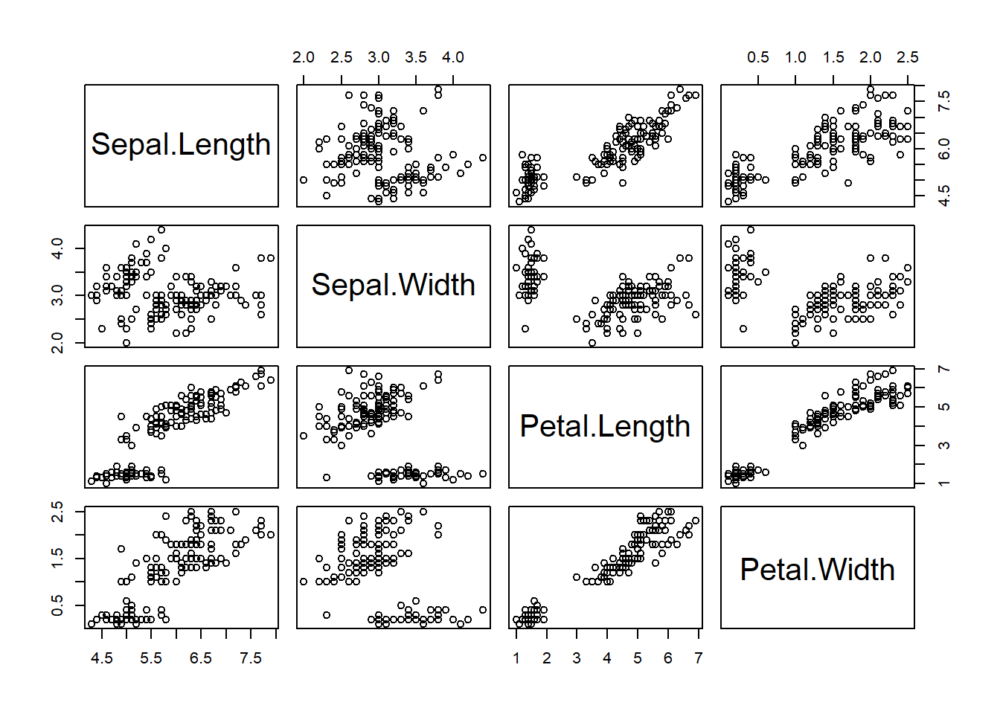
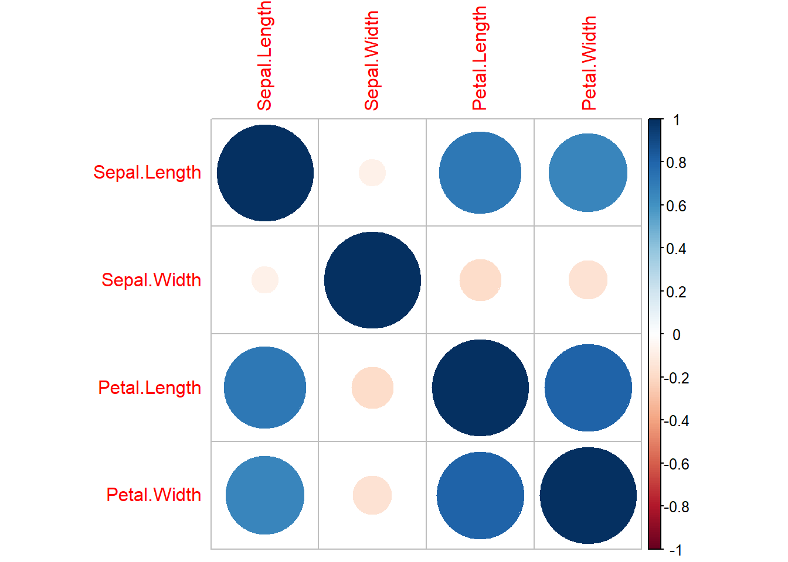
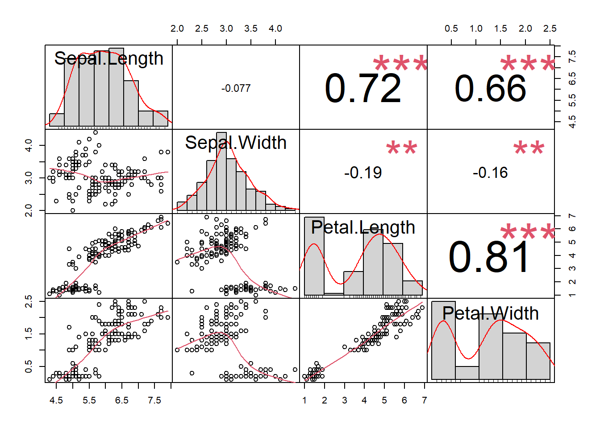

# (PART) Statistiques descriptives {.unnumbered}

# Statistiques univariées

## Variables quantitatives

### Mesurer les valeurs centrales

En gros, la tendance centrale mesure la "moyenne" ou le "milieu" de vos
données.

-   La moyenne : la valeur moyenne. Elle est sensible aux valeurs
    aberrantes. `mean()`

-   La médiane : la valeur moyenne. C'est une alternative robuste à la
    moyenne : `sd()`

-   mode : la valeur la plus fréquente : `mfv()`

On peut cacluer la moyenne pondérée avec la fonction `weighted.mean()`.

Si les vecteurs contiennent des données manquantes (`NA`), ajouter
l'argument `na.rm=TRUE` aux fonctions `mean()` et `median()`. La
fonction `mod()` gère par défaut les données manquantes.

Les valeurs inhabituelles, appelées valeurs aberrantes, peuvent avoir
davantage d'impact sur la moyenne que sur la médiane. Si vos données
sont symétriques, la moyenne et la médiane sont similaires.


```r
library(dplyr)
```

```
## 
## Attachement du package : 'dplyr'
```

```
## Les objets suivants sont masqués depuis 'package:stats':
## 
##     filter, lag
```

```
## Les objets suivants sont masqués depuis 'package:base':
## 
##     intersect, setdiff, setequal, union
```

```r
iris %>%
group_by(Species) %>%
summarise(weighted.mean(Sepal.Length, Petal.Length, na.rm = TRUE))
```

```
## # A tibble: 3 × 2
##   Species    `weighted.mean(Sepal.Length, Petal.Length, na.rm = TRUE)`
##   <fct>                                                          <dbl>
## 1 setosa                                                          5.02
## 2 versicolor                                                      5.98
## 3 virginica                                                       6.64
```

### Les indicateurs de dispersion

Un indicateur de dispersion mesure la variabilité des valeurs d'une
série statistique. Il est toujours positif et d'autant plus grand que
les valeurs de la série sont étalées. Les plus courants sont :

-   la **variance** : `var()`

-   l'**écart-type** : `sd()`

-   l'**écart interquartile** : `IQR()`

La variance représente l'écart moyen au carré par rapport à la moyenne.
L'écart-type est la racine carrée de la variance. Il mesure l'écart
moyen des valeurs, dans les données, par rapport à la valeur moyenne.

L'écart-type est utilisé comme mesure de la dispersion lorsque la
moyenne est utilisée comme mesure de la tendance centrale (c'est-à-dire
pour des données numériques symétriques). Pour les données ordinales ou
les données numériques asymétriques, on utilise la médiane et l'écart
interquartile.

Les quantiles divisent en 4 les données. L'écart interquantile
(Interquantile Range -- IRQ) correspond à la différence entre le premier
et le troisième quantile. Il peut être une robuste alternative à
l'écart-type. L'écart interquantile est souvent utilisé avec la médiane
et est assez robuste aux valeurs aberrantes.

On peut également calculer les déciles : au lieu de séparer en quatre en
sépare en 10.

Les paramètres de dispersion donnent une indication de la variabilité
des données, tandis que l'intervalle de confiance et l'erreur standard
donnent une indication de la précision d'un paramètre de position.

En particulier, la taille d'une série de données n'a pas d'impact sur sa
dispersion (la variabilité n'augmente ou ne diminue pas avec le nombre
d'individus) mais en a un sur la précision des paramètres de position
(cette précision augmente avec le nombre d'individus).

### Intervalles de confiance et erreur standard

L'intervalle de confiance et l'erreur standard permettent d'estimer la
précision d'une grande variété de paramètres. Les trois cas les plus
courants sont une moyenne, une médiane (pour laquelle seul l'intervalle
de confiance a du sens) et une proportion.

Pour toutes les fonctions calculant un intervalle de confiance, la
précision de cet intervalle peut être modifiée grâce à l'argument
`conf.level` (par défaut `conf.level=0.95`, ce qui calcule l'intervalle
de confiance à 95 %).

**Moyenne :**

-   Intervalle de confiance :

    -   n \>= 30 : `t.test(serie)$conf.int`. Paramétrique où serie est
        un vecteur contenant la série de données

    -   n \< 30 : `bootstrap(serie,function(x,i) mean(x[i]))`. Non
        paramétrique

-   Erreur standard :

    -   `se()` (quelque soit l'effectif)

**Médiane :**

-   Intervalle de confiance :

    -   Si la série de données ne contient pas de 0 et quel que soit
        l'effectif : `wilcox.signtest(serie)$conf.int1`

    -   Si la série de données contient au moins un 0 et quel que soit
        l'effectif : `wilcox.signtest(serie,mu=valeur)$conf.int` où
        valeur est une valeur quelconque absente de la série de données

**Proportion :**

-   Intervalle de confiance :

    -   Quelque soit l'effectif : `binom.test(a,b)$conf.int` où a est le
        nombre d'individus de la catégorie d'intérêt et b l'effectif
        total.

-   Erreur standard :

    -   Quelque soit l'effectif : `se(a,b)`

#### Valeurs aberrantes

L'identification des données aberrantes est une étape obligatoire de
toute analyse statistique. Elle se fait essentiellement visuellement,
grâce à des graphes du type histogramme ou boîtes à moustaches.

La suppression d'éventuelles données aberrantes est un point hautement
plus délicat que leur simple identification. Supprimer une ou plusieurs
donnée(s) aura nécessairement un effet sur les analyses qui vont suivre,
et cet effet sera d'autant plus important que l'effectif de
l'échantillon est faible. Il est donc tentant de supprimer les individus
qui orientent les résultats vers des conclusions inverses à celles qui
sont attendues.

En biologie, par exemple, il n'y a globalement que deux raisons qui
doivent pousser à éliminer une donnée :

-   s'il y a manifestement eu une erreur technique dans la mesure ou
    dans la retranscription de la donnée (par exemple si l'appareil de
    mesure est défectueux)

-   si la valeur de la mesure obtenue est biologiquement improbable pour
    la variable mesurée. En dehors de ces deux cas, il y a de grandes
    chances pour que la valeur « aberrante » soit simplement une
    singularité biologique de l'individu mesuré. Cette singularité est
    l'expression de la variabilité naturelle de tout caractère
    biologique, rien ne justifie donc que l'individu soit supprimé de
    l'étude.

Dans tous les cas, l'identification et la suppression éventuelle de
données aberrantes doit se faire avant tout autre analyse.\

Mesurer la variabilité

La variabilité exprime comment les données sont "dispersées".

**Visualisation :** Boxplot

##### Range : minimum et maximum

`min()` renvoie le minimum\
`maximum()` renvoie le maximum\
`range()` renvoie le minimum et le maximum

##### Écart interquantile

Les quantiles divisent en 4 les données. L'écart interquantile
(Interquantile Range -- IRQ) correspond à la différence entre le premier
et le troisième quantile. Il peut être une robuste alternative à
l'écart-type.

On peut également calculer les déciles : au lieu de séparer en quatre en
sépare en 10.


```r
quantile(iris$Sepal.Length, probs = seq(0, 1, 0.10))
```

```
##   0%  10%  20%  30%  40%  50%  60%  70%  80%  90% 100% 
## 4.30 4.80 5.00 5.27 5.60 5.80 6.10 6.30 6.52 6.90 7.90
```

L'écart interquantile est souvent utilisé avec la médiane et est assez
robuste aux valeurs aberrantes.

##### La variance et l'écart type

La variance représente l'écart moyen au carré par rapport à la moyenne.
L'écart-type est la racine carrée de la variance. Il mesure l'écart
moyen des valeurs, dans les données, par rapport à la valeur moyenne.

#### Calculer un résumer pour une variable ou un data frame

La variance représente l'écart moyen au carré par rapport à la moyenne.
L'écart-type est la racine carrée de la variance. Il mesure l'écart
moyen des valeurs, dans les données, par rapport à la valeur moyenne.


```r
library(pastecs)
```

```
## Warning: le package 'pastecs' a été compilé avec la version R 4.2.2
```

```
## 
## Attachement du package : 'pastecs'
```

```
## Les objets suivants sont masqués depuis 'package:dplyr':
## 
##     first, last
```

```r
# On calcul les statistiques pour la colonne 5 du tableau round(res, 2)
stat.desc(iris[, 2])
```

```
##      nbr.val     nbr.null       nbr.na          min          max        range 
## 150.00000000   0.00000000   0.00000000   2.00000000   4.40000000   2.40000000 
##          sum       median         mean      SE.mean CI.mean.0.95          var 
## 458.60000000   3.00000000   3.05733333   0.03558833   0.07032302   0.18997942 
##      std.dev     coef.var 
##   0.43586628   0.14256420
```

```r
library(summarytools)
# statistiques pour tous le df
view(dfSummary(iris))
```

```
## Switching method to 'browser'
```

```
## Output file written: C:\Users\antoi\AppData\Local\Temp\Rtmp0uuSlE\file96ac5f6a1650.html
```

On peut tout aussi bien utiliser cette fonction pour l'ensemble des
variables d'un `df`.

#### Calculer un tableau croisé dynamique

R permet de calculer très simplement tableau croisé dynamique pour une
variable.


```r
table(dplyr::starwars$hair_color)
```

```
## 
##        auburn  auburn, grey auburn, white         black         blond 
##             1             1             1            13             3 
##        blonde         brown   brown, grey          grey          none 
##             1            18             1             1            37 
##       unknown         white 
##             1             4
```

### Les données manquantes

Si on souhaite connaître le nombre `NA` que l'on a dans chaque variables
on peut utiliser le code suivant :


```r
colSums(is.na(starwars))
```

```
##       name     height       mass hair_color skin_color  eye_color birth_year 
##          0          6         28          5          0          0         44 
##        sex     gender  homeworld    species      films   vehicles  starships 
##          4          4         10          4          0          0          0
```

Si on a des données cela peut perturber les fonctions. Pour éviter cela
on peut utiliser l'argument `na.rm = TRUE`.


```r
# retirer les NAs dans le calcul d'une moyenne
mean(dplyr::starwars$mass, na.rm = TRUE)
```

```
## [1] 97.31186
```

Si on veut **supprimer les lignes contenants des données manquantes** on
peut utiliser la fonction `na.omit()`.


```r
na.omit(dplyr::starwars)
```

```
## # A tibble: 29 × 14
##    name        height  mass hair_…¹ skin_…² eye_c…³ birth…⁴ sex   gender homew…⁵
##    <chr>        <int> <dbl> <chr>   <chr>   <chr>     <dbl> <chr> <chr>  <chr>  
##  1 Luke Skywa…    172    77 blond   fair    blue       19   male  mascu… Tatooi…
##  2 Darth Vader    202   136 none    white   yellow     41.9 male  mascu… Tatooi…
##  3 Leia Organa    150    49 brown   light   brown      19   fema… femin… Aldera…
##  4 Owen Lars      178   120 brown,… light   blue       52   male  mascu… Tatooi…
##  5 Beru White…    165    75 brown   light   blue       47   fema… femin… Tatooi…
##  6 Biggs Dark…    183    84 black   light   brown      24   male  mascu… Tatooi…
##  7 Obi-Wan Ke…    182    77 auburn… fair    blue-g…    57   male  mascu… Stewjon
##  8 Anakin Sky…    188    84 blond   fair    blue       41.9 male  mascu… Tatooi…
##  9 Chewbacca      228   112 brown   unknown blue      200   male  mascu… Kashyy…
## 10 Han Solo       180    80 brown   fair    brown      29   male  mascu… Corell…
## # … with 19 more rows, 4 more variables: species <chr>, films <list>,
## #   vehicles <list>, starships <list>, and abbreviated variable names
## #   ¹​hair_color, ²​skin_color, ³​eye_color, ⁴​birth_year, ⁵​homeworld
```

### Déterminer la distribution des données

If the sample size is large enough (n \~ 30), we can ignore the
distribution of the data and use parametric tests.

**The central limit theorem** tells us that no matter what distribution
things have, the sampling distribution tends to be normal if the sample
is large enough (n \> 30).

#### Test de normalité

##### Méthode visuelle

##### Test de normalité {#sec:test-de-normalite}

Shapiro-Wilk's method is widely recommended for normality test and it
provides better power than K-S. It is based on the correlation between
the data and the corresponding normal scores.

Hypothèse de test :

-   H0 : La distribution suit la loi normale

-   H1 (Ha) : La distribution ne suit pas la loi normale

Si le test est **significatif** (p \< 0.05 par exemple) H0 est rejeté.
Donc, avec p \< 0.05 on rejette l'hypothèse : pas de normalité.


```r
# Pour une seule variable 
shapiro.test(iris$Sepal.Width)
```

```
## 
## 	Shapiro-Wilk normality test
## 
## data:  iris$Sepal.Width
## W = 0.98492, p-value = 0.1012
```

La p-value est supérieur à 0.05, on ne peut pas rejeter $H_0$ :
`Sepal.width` est possède une distribution similaire à celle d'une
distribution normale. En d'autres termes, une valeur $p$ de 0,1 pour le
test de Shapiro-Wilk indique une probabilité de 10% d'observer la
statistique de test si l'hypothèse nulle ($H_0$) de normalité est vraie.

Pour toute les variables d'un df, on peut utiliser la fonction suivante


```r
shapiro_test_df <- function(df, bonf= TRUE, alpha= 0.05) {
                        l <- lapply(df, shapiro.test)
                        s <- do.call("c", lapply(l, "[[", 1))
                        p <- do.call("c", lapply(l, "[[", 2))
                        if (bonf == TRUE) {
                            sig <- ifelse(p > alpha / length(l), "H0", "Ha")
                        } else {
                            sig <- ifelse(p > alpha, "H0", "Ha")
                        }
                        return(list(statistic= s,
                        p.value= p,
                        significance= sig,
                        method= ifelse(bonf == TRUE, "Shapiro-Wilks test with Bonferroni Correction",
                                       "Shapiro-Wilks test without Bonferroni Correction")))
                    }
iris %>%
  select(where(is.numeric))%>% # Sélection des variables numériques
  shapiro_test_df()  
```

```
## $statistic
## Sepal.Length.W  Sepal.Width.W Petal.Length.W  Petal.Width.W 
##      0.9760903      0.9849179      0.8762681      0.9018349 
## 
## $p.value
## Sepal.Length  Sepal.Width Petal.Length  Petal.Width 
## 1.018116e-02 1.011543e-01 7.412263e-10 1.680465e-08 
## 
## $significance
## Sepal.Length  Sepal.Width Petal.Length  Petal.Width 
##         "Ha"         "H0"         "Ha"         "Ha" 
## 
## $method
## [1] "Shapiro-Wilks test with Bonferroni Correction"
```

Dans le jeu de donnée `iris`, seul `Sepal.Width` suit une distribution
normale.

## Les tests

### Tests paramétriques et non paramétriques

Afin de savoir quel test utiliser, paramétrique ou non-paramétrique, on
doit se demander, dans l'ordre :

1.  **Normally distributed data :** courbe gausienne. test de
    Shapiro-Wilk. Q-Q plot.
2.  **Homogeneity of variance :** this assumption means that the
    variances should be the same throughout the data homoscedasticité.
    Il faut pouvoir comparer des choses suffisament proche. Si la
    variance des variables est trop différente les unes des autres on ne
    pourra comparer. n = 2 test de fisher; n \> 2 test de Barklet.
3.  **Independence :** the behaviour of one participant does not
    influence the behaviour of another

Un test paramétrique la valeur prise par les observation est moins
importante.

1.  **À quoi sert le test ?**
    -   Exemple : « comparer les variances »
2.  **Question précédente permet de formuler H0 --- H0 :**
    -   les variances sont « égales »
3.  **Quel est le risque si on rejette H0 ?**
    -   Valeur de la p-value \alpha
4.  **Ce risque est-il acceptable comparée à l'intervalle de confiance**
    \alpha ?
    -   Si p-value \< \alpha le risque est acceptable. On considère que
        c'est le cas donc oui.
5.  Rejette-t-on H0 ?
    -   Dans notre exemple oui (toujours même réponse que la précédente)
6.  Conclusion
    -   On rejette H0 car le risque (de première espèce) de la rejeter
        est faible, on a peut de chance de se gourer. Les variances ne
        sont donc pas égales.

On peut se dire que l'on "essaye" de rejeter$H_0$. On y arrive quand la
p-value est inférieur à la valeur seuil définie au préalable ($\alpha$).

#### Test de normalité

*cf.* ci-dessus

#### Comparaison de variance --- homoscédasticité

On utilise le *test de* *fischer*.

$H_0$ : les variables sont égales


```r
var.test(iris$Sepal.Width, iris$Sepal.Length)
```

```
## 
## 	F test to compare two variances
## 
## data:  iris$Sepal.Width and iris$Sepal.Length
## F = 0.27706, num df = 149, denom df = 149, p-value = 3.595e-14
## alternative hypothesis: true ratio of variances is not equal to 1
## 95 percent confidence interval:
##  0.2007129 0.3824528
## sample estimates:
## ratio of variances 
##          0.2770617
```

La p-value est égale à 3.595e-14. On peut rejeter $H_0$, les variances
ne sont donc pas égales.

### Tests sur variables quantitatives

#### Comparaison de moyenne

##### Paramétrique

Quand le nombre de variable à tester est de 2 on utilise le *test de
student*.

$H_0$ : les moyennes de deux populations sont égales. ce qui signifie
qu'il n'y a pas de différence significative entre les moyennes.


```r
t.test(iris$Sepal.Length, iris$Sepal.Width)
```

```
## 
## 	Welch Two Sample t-test
## 
## data:  iris$Sepal.Length and iris$Sepal.Width
## t = 36.463, df = 225.68, p-value < 2.2e-16
## alternative hypothesis: true difference in means is not equal to 0
## 95 percent confidence interval:
##  2.63544 2.93656
## sample estimates:
## mean of x mean of y 
##  5.843333  3.057333
```

Une p-value inférieure à 2.2e-16 que les moyennes sont significativement
différentes, car la probabilité d'obtenir cette p-value sous l'hypothèse
nulle (les moyennes sont égales) est très faible.

Si le nombre de variable à tester est supérieur à deux on utilise
l'ANOVA.


```r
#aov()
#summary(aov())
```

***Expliquer***

##### Non-paramétrique

Avec deux variables, on utilise le teste de *Wilcoxon-Mann-Whitney.*

C'est un test de rang. Apporte des différences moins grande pour être
sûr qu'il y a des différences effectives. Techniquement, c'est un test
de comparaison de médiane.


```r
wilcox.test(iris$Sepal.Length, iris$Sepal.Length)
```

```
## 
## 	Wilcoxon rank sum test with continuity correction
## 
## data:  iris$Sepal.Length and iris$Sepal.Length
## W = 11250, p-value = 1
## alternative hypothesis: true location shift is not equal to 0
```

### Tests sur variables qualitatives

#### Test d'indépendance $\chi^2$

Estimer si deux variables qualitatives sont indépendante et donc sy
elles sont dépendante.

L'indépendance entre deux caractères qualitatifs signifie que les
modalités d'un caractère se distribuent de la même façon pour chacune
des modalités de l'autre caractère.

Par exemple, la couleur des yeux est-elle indépendante de la couleur des
cheveux ? Si oui, les caractères sont indépendants et on a autant de
chance d'avoir les yeux bleus sachant qu'on a les cheveux blond ou qu'on
a les cheveux brun.

**Conditions :**

-   L'effectif théorique calculé sous l'hypothèse $H_0$ doit être
    supérieur à 5 (*i.e.* l'effectif d'une cellule d'un tableau doit
    être \> à 5). Dans le cas contraire, on utilise le test
    non-paramétrique *exact de fischer*.

When one or more of the expected frequencies is less than 4 (or 5
depending on the rule of thumb you follow) then it is wrong to use
Pearson's chi-squared or log-linear models (G tests) for your
contingency table. This is because small expected values inflate the
value of the test statistic, and it no longer can be assumed to follow
the chi-squared distribution.

Supposons que vous vouliez déterminer s'il existe une association
significative entre l'habitude de fumer d'une personne et le
développement d'un cancer du poumon. Vous recueillez des données auprès
de 100 personnes et créez un tableau de contingence 2x2 :

| Eye color | Sweet | Salty |
|-----------|-------|-------|
| Brown     | 20    | 10    |
| Blue      | 4     | 15    |


```r
# tableau de contingence
table <- matrix(c(20, 10, 4, 15), nrow=2, byrow=TRUE)
fisher.test(table)
```

```
## 
## 	Fisher's Exact Test for Count Data
## 
## data:  table
## p-value = 0.003051
## alternative hypothesis: true odds ratio is not equal to 1
## 95 percent confidence interval:
##   1.700824 37.824226
## sample estimates:
## odds ratio 
##   7.160555
```

Dans cet exemple, le test exact de Fisher fourni un test plus précis de
l'association entre la couleur des yeux et la préférence alimentaire,
par rapport au test du chi-deux, car l'une des cellules du tableau de
contingence comporte moins de 5 observations.

**Conditions**

Le cas des zéros :

A single zero cell is not of itself of major consequence; nor even two
in a 2x2 table if they don't share a row or column. That is, case 1
should not present any issue - your estimate of the odds ratio should be
infinite and your p-value should be almost 0.

However two 0's in the same row or column is problematic. If you
condition on the margins (as is the case with the Fisher test), there's
only one possible table consistent with both margins; your p-values will
always be 1. In those specific circumstances there's nothing to be done
about that, there's no information about relative proportions in the
zero row (or column, as appropriate).

Unconditionally you might just about be able to have some way to get to
a p-value that's not exactly 1 (I haven't tried to come up with a way
that would) -- but even if you could, it's really not going to help you
much; the uncertainty in the proportions will swamp the effect in the
mean (i.e. I believe you would still not be able to tell the relative
proportions apart, since the uncertainty around any estimates would be
almost entirely overlapping).

### Déterminer les corrélations

#### Évaluation visuelle

On peut, dans un premier temps, réaliser un *scatterplot* qui permet
d'établir directement une relation entre toutes les variables d'un
data.frame.


```r
plot(iris[,1:4])
```



Ici on remarque directement une relation entre la variable
`Petal.Lenght` et la variable `Petal.Width`.\
On peut également afficher une matrice des corrélation avec la librairie
`corrplot`.


```r
library(corrplot)
```

```
## corrplot 0.92 loaded
```

```r
corrplot(cor(iris[,1:4], method = "kendal"))
```



On remarque bien la corrélation entre `Petal.Lenght` et la variable
`Petal.Width` mais également entre `Petal.Lenght` et `Sepal.Length`.

Si on a des valeurs manquantes la fonction ne va pas fonctionner, il
faut alors utiliser l'argument : `use = "complete.obs"`

La fonction `cor()` retourne seulement le coefficient de corrélation. On
peut également calculer la p-value.


```r
cor.mtest(iris[,1:4], method = "kendal", use = " complete.obs", conf.level = .95) # on calcule la p=value
```

```
## $p
##              Sepal.Length Sepal.Width Petal.Length  Petal.Width
## Sepal.Length 0.000000e+00 0.182921015 1.169126e-36 8.801486e-30
## Sepal.Width  1.829210e-01 0.000000000 1.283268e-03 7.518013e-03
## Petal.Length 1.169126e-36 0.001283268 0.000000e+00 2.443446e-44
## Petal.Width  8.801486e-30 0.007518013 2.443446e-44 0.000000e+00
## 
## $lowCI
##              Sepal.Length Sepal.Width Petal.Length Petal.Width
## Sepal.Length            1          NA           NA          NA
## Sepal.Width            NA           1           NA          NA
## Petal.Length           NA          NA            1          NA
## Petal.Width            NA          NA           NA           1
## 
## $uppCI
##              Sepal.Length Sepal.Width Petal.Length Petal.Width
## Sepal.Length            1          NA           NA          NA
## Sepal.Width            NA           1           NA          NA
## Petal.Length           NA          NA            1          NA
## Petal.Width            NA          NA           NA           1
```

On peut ainsi compiler une matrice des corrélations comprenant les
coefficients de corrélation et les p-value.

La significativité des p-value est indiquée comme suit :

-   \* : 0.05

-   \*\* : 0.01

-   \*\*\* : 0.001

La fonction `chart.Correlation()` du package `PerformanceAnalytics`
permet également de visualiser les corrélations en plus de la
distribution de chaque variables.


```r
library(PerformanceAnalytics)
```

```
## Warning: le package 'PerformanceAnalytics' a été compilé avec la version R 4.2.2
```

```
## Le chargement a nécessité le package : xts
```

```
## Le chargement a nécessité le package : zoo
```

```
## 
## Attachement du package : 'zoo'
```

```
## Les objets suivants sont masqués depuis 'package:base':
## 
##     as.Date, as.Date.numeric
```

```
## 
## Attachement du package : 'xts'
```

```
## Les objets suivants sont masqués depuis 'package:pastecs':
## 
##     first, last
```

```
## Les objets suivants sont masqués depuis 'package:dplyr':
## 
##     first, last
```

```
## 
## Attachement du package : 'PerformanceAnalytics'
```

```
## L'objet suivant est masqué depuis 'package:graphics':
## 
##     legend
```

```r
chart.Correlation(
  iris[,1:4],
  histogram = TRUE,
  method = "kendall"
  ) # A specification for the type of points
```

```
## Warning in par(usr): argument 1 does not name a graphical parameter
```

```
## Warning in par(usr): argument 1 does not name a graphical parameter

## Warning in par(usr): argument 1 does not name a graphical parameter

## Warning in par(usr): argument 1 does not name a graphical parameter

## Warning in par(usr): argument 1 does not name a graphical parameter

## Warning in par(usr): argument 1 does not name a graphical parameter
```



#### 

Les test de corrélations

##### La corrélation de Pearson

La corrélation de Pearson mesure une relation linéaire entre deux
variables (x et y). C'est un test paramétrique il dépend de la
distribution des données. Il peut être utilisé uniquement si $x$ et $y$
sont issus d'un distribution normale.

$$
r_{xy}={\frac {\sum _{i=1}^{n}(x_{i}-{\bar {x}})(y_{i}-{\bar {y}})}{{\sqrt {\sum _{i=1}^{n}(x_{i}-{\bar {x}})^{2}}}{\sqrt {\sum _{i=1}^{n}(y_{i}-{\bar {y}})^{2}}}}}
$$

où :

-   $n$ est le taille de l'échantillon

-   $x_i$, $y_i$ sont les individus de échantillonés indexés par $i$

-   ${\bar{x}}={\frac {1}{n}}\sum _{i=1}^{n}x_{i}$ la moyenne de
    l'échantillon, de même pour ${\bar y}$

$r_{x,y}$ est le coefficient de corrélation entre les variables $x$ et
$y$.


```r
cor.test(iris$Sepal.Length, iris$Petal.Length, method = "pearson") # s’il y a des données manquantes (case=wise deletion) : cor( x, y, method = "pearson", use = "complete.obs") 4 res
```

```
## 
## 	Pearson's product-moment correlation
## 
## data:  iris$Sepal.Length and iris$Petal.Length
## t = 21.646, df = 148, p-value < 2.2e-16
## alternative hypothesis: true correlation is not equal to 0
## 95 percent confidence interval:
##  0.8270363 0.9055080
## sample estimates:
##       cor 
## 0.8717538
```

Interprétation :

-   -1 indicates a strong negative correlation : this means that every
    time x increases, y

-   0 means that there is no association between the two variables (x
    and y).

-   1 indicates a strong positive correlation : this means that y
    increases with x.

##### La corrélation de Spearman

##### La corrélation de Kendall
